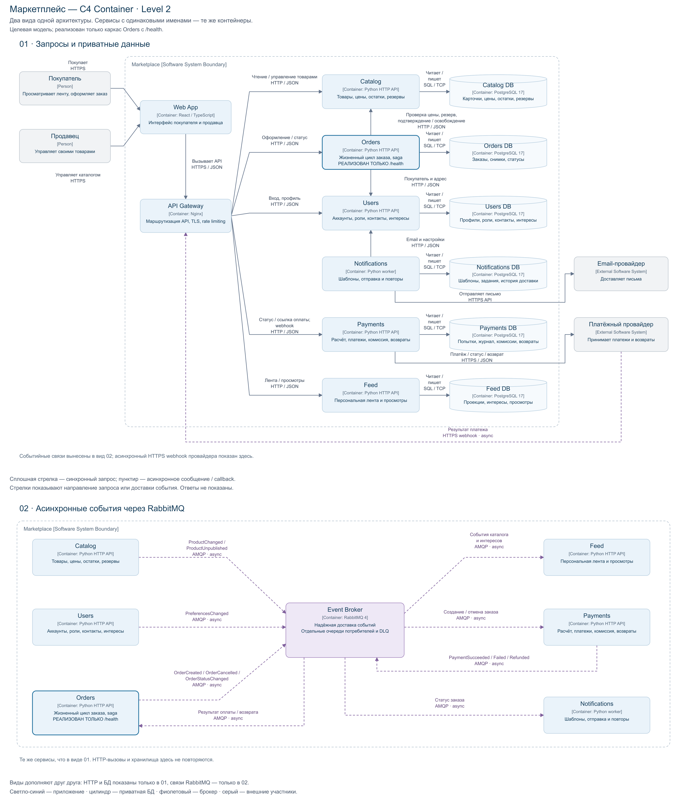

# Маркетплейс: архитектура C4 и каркас сервиса

Учебный проект по сервис-ориентированной архитектуре. Спроектирована платформа,
где продавцы публикуют товары, а покупатели получают персонализированную ленту,
оформляют и оплачивают заказы и получают уведомления об их статусах.

**Реализован только инфраструктурный каркас Orders Service:** HTTP-сервер,
`GET /health` и Docker-образ. Бизнес-логики, базы данных, брокера,
авторизации и бизнес-API в коде нет. Все остальные компоненты ниже — целевая
архитектура, а не обещание работающей реализации.

## 1. C4 Container



[Открыть полную диаграмму](docs/architecture/container.png)

Для удобства чтения одна C4-модель представлена двумя согласованными видами:

1. **Запросы и приватные данные** — интерфейс, Gateway, HTTP-вызовы, отдельные
   базы и внешние провайдеры (верхняя часть диаграммы).
2. **Асинхронные события** — производители, RabbitMQ и потребители событий
   (нижняя часть диаграммы).

Повторяющиеся сервисы — те же контейнеры, а не дополнительные экземпляры.
Полная диаграмма объединяет оба вида: сохранены все **19 элементов и 28 связей**.

Это уровень **C4 Level 2 (Container)**: люди и внешние системы находятся за
границей Marketplace; внутри показаны исполняемые приложения, брокер и
хранилища. Каждый контейнер подписан названием, типом, технологией и
ответственностью. Стрелки показывают направление запроса или доставки события,
содержат назначение и протокол; ответ синхронного вызова подразумевается.
Пунктир — асинхронное взаимодействие, сплошная линия — синхронное.
Цилиндры — отдельные хранилища; серые блоки — внешние системы и люди.
C4-контейнер — архитектурная единица, не обязательно Docker-контейнер.

## 2. Запуск сервиса в Docker

Требования: запущенный Docker Engine / Docker Desktop / Colima, Docker Compose
v2+ с поддержкой `up --wait`, свободный порт 8080. Первая сборка требует доступа
к Docker Hub для загрузки `python:3.13-slim`. Другие зависимости не скачиваются.
Все команды выполняются из корня этого проекта.

```sh
docker compose up --build -d --wait --wait-timeout 60
docker compose ps
curl -i http://localhost:8080/health
```

Ожидаемый ответ (заголовки даты и сервера могут отличаться):

```http
HTTP/1.0 200 OK
Content-Type: application/json; charset=utf-8
Content-Length: 16

{"status":"ok"}
```

Compose поднимает **ровно один сервис `orders`**. В `docker compose ps` его
состояние должно быть `Up ... (healthy)`. Docker проверяет настоящий HTTP-ответ
изнутри контейнера каждые 5 секунд. Приложение слушает `0.0.0.0:8080` внутри
контейнера, а порт на хосте опубликован только на `127.0.0.1`.

Если порт занят, можно выбрать другой:

```sh
ORDERS_PORT=18080 docker compose up --build -d --wait --wait-timeout 60
curl -i http://localhost:18080/health
```

Логи и остановка:

```sh
docker compose logs orders
docker compose down
```

Локально, без Docker (Python 3.13+, сторонние пакеты не нужны):

```sh
python3 -m services.orders.app
```

Проверить ответ можно командой `curl -i http://localhost:8080/health`
из другого терминала. Неизвестный `GET` возвращает
`404`, неподдерживаемый `POST` — стандартный для этого HTTP-сервера `501`.

`/health` — проверка жизнеспособности HTTP-процесса, не готовности бизнес-системы.
В каркасе внешних зависимостей нет. При их появлении потребуется отдельный
`/ready`; недоступность платёжного провайдера не должна выключать liveness.
Стандартный Python HTTP-сервер выбран только для учебного каркаса, не для
публичной production-нагрузки. Образ запускается не от root, файловая система
контейнера доступна только для чтения, Linux capabilities сброшены.

## 3. Домены, сервисы и владение данными

Финальный вариант — **шесть доменных сервисов**, Web App, API Gateway и брокер.
Web App и Gateway — технические контейнеры, не отдельные бизнес-домены.
Стек целевой модели: React + TypeScript для Web App, Nginx для Gateway,
Python HTTP API для сервисов, PostgreSQL 17 для каждого доменного хранилища,
RabbitMQ 4 для событий. Конкретный production Python-фреймворк не выбирается
на этапе каркаса; его выбор не меняет границы доменов.

| Домен → сервис | Ответственность | Собственные данные / источник истины |
| --- | --- | --- |
| Пользователи → **Users** | Регистрация, вход, роли покупателя и продавца, профиль, контакты и согласия | Users DB: аккаунты, хеши паролей, роли, адреса, контакты, настройки уведомлений, явно выбранные интересы |
| Каталог → **Catalog** | Товары продавцов, категории, публикация, актуальные цены, остатки и резервы | Catalog DB: карточки, `seller_id`, цены, остатки, резервы с TTL; изображения представлены URL |
| Персонализированная лента → **Feed** | Ранжирование и выдача товаров, обработка предпочтений и просмотров | Feed DB: собственная read-модель каталога, проекция интересов, агрегаты просмотров; не источник истины о цене или наличии |
| Заказы → **Orders** | Создание и жизненный цикл заказа, координация резервирования и оплаты | Orders DB: заказ, `buyer_id`, строки с `seller_id`, снимки названий/цен, адрес на момент заказа, итог, статусы, ключи идемпотентности |
| Платежи → **Payments** | Расчёт суммы к списанию и комиссии из подтверждённого заказа, учёт платежей и возвратов, интеграция с провайдером | Payments DB: платёжные попытки, суммы в минимальных денежных единицах, валюта, комиссия, записи финансового учёта, идентификаторы провайдера и обработанных webhook |
| Уведомления → **Notifications** | Отправка сообщений о статусах, шаблоны, повторы, история доставки | Notifications DB: шаблоны, задания доставки, результаты попыток и ключи дедупликации; контакты получает из Users |

**Общих баз нет.** На диаграмме каждому сервису соответствует собственная БД.
В целевом развёртывании — отдельные экземпляры PostgreSQL и отдельные учётные
данные. Только владелец читает и изменяет своё хранилище; межсервисных SQL JOIN,
внешних ключей и прямого чтения чужих таблиц нет. Ссылки между доменами — ID.
Снимок цены в Orders и проекция товара в Feed — осознанные локальные копии с
разным назначением, а не разделяемое владение.

Web App не хранит доменных данных; Gateway хранит только конфигурацию маршрутов
и технических ограничений. RabbitMQ хранит сообщения до обработки, но не
заменяет доменные БД и финансовый журнал. Внешний платёжный провайдер владеет
карточными реквизитами; маркетплейс их не хранит.

### Почему домены разделены именно так

- Users объединяет покупателей и продавцов: это роли одного аккаунта, а не
  разные модели аутентификации. Один пользователь может обладать обеими ролями.
- Catalog объединяет карточки, цены и остатки: здесь проходят локальные
  транзакции публикации и резервирования. Отдельный Inventory пока усложнит
  оформление заказа без подтверждённой потребности.
- Feed отделён от Catalog: частые чтения и пересчёт ранжирования должны
  масштабироваться независимо от операций продавцов. Задержка проекций допустима.
- Orders отделён от Payments: состояние заказа и фактическое движение денег
  различаются, требуют разных проверок, прав доступа и способов восстановления.
- Notifications отделён от Orders: сбой почтового провайдера не должен отменять
  заказ или блокировать обработку оплаты.

### Принятые допущения и персонализация

На старте: одна валюта RUB, фиксированная комиссия платформы 5%, только email,
один платёж за заказ с товарами нескольких продавцов. Итог заказа — сумма
`цена × количество` по зафиксированным строкам. Скидки, налоги, доставка,
выплаты продавцам и сложный антифрод вне границ задания. Payments проверяет
согласованность суммы, фиксирует сумму списания и комиссию. Комиссия округляется
до копеек один раз от итога, удерживается из суммы, а не добавляется покупателю.
Повтор платёжной попытки не меняет согласованную сумму заказа.

Выбрана **простая персонализация без ML**: Feed отдаёт доступные опубликованные
товары из своей проекции; сначала товары из категорий, явно выбранных в Users,
затем из наиболее просматриваемых пользователем категорий за последние 30 дней,
затем остальные. Внутри групп — популярность по просмотрам за 7 дней, потом
дата публикации и ID для стабильного порядка. При отсутствии истории/интересов
вся лента сортируется по популярности и новизне. Просмотры принимает Feed через
Gateway. Это достаточная для кейса персонализация с прозрачным объяснением,
без отдельной ML-платформы. История просмотров ограничена 30 днями.

Цены и наличие в ленте могут кратковременно устаревать: при оформлении Orders
проверяет их у Catalog. Изменение цены требует нового подтверждения покупателя,
а не тихого списания другой суммы. При отказе Feed каталог остаётся доступен
через Gateway без персонализации. Целевой лаг проекции — до 5 секунд в штатном
режиме; это проектная цель, не результат измерений данного каркаса.

## 4. Взаимодействия

| Инициатор → получатель | Способ | Назначение |
| --- | --- | --- |
| Покупатель/продавец → Web App | Синхронно, HTTPS | Работа в браузере |
| Web App → Gateway | Синхронно, HTTPS/JSON | Единая точка входа API |
| Gateway → Users | Синхронно, HTTP/JSON во внутренней сети | Вход, профиль, роли, интересы |
| Gateway → Catalog | Синхронно, HTTP/JSON | Карточки товаров и операции продавца |
| Gateway → Feed | Синхронно, HTTP/JSON | Лента и регистрация просмотра |
| Gateway → Orders | Синхронно, HTTP/JSON | Оформление и получение статуса заказа |
| Gateway → Payments | Синхронно, HTTP/JSON | Получение статуса/ссылки на оплату своего заказа; проксирование webhook провайдера |
| Orders → Catalog | Синхронно, HTTP/JSON | Проверить цены, зарезервировать, подтвердить/освободить резерв |
| Orders → Users | Синхронно, HTTP/JSON | Проверить покупателя, получить подтверждённый адрес для снимка |
| Notifications → Users | Синхронно, HTTP/JSON | Получить актуальный email и разрешённый способ уведомления |
| Payments → платёжный провайдер | Синхронно, HTTPS/JSON | Создать платёж, запросить статус, инициировать возврат |
| Провайдер → Gateway → Payments | Асинхронный callback, HTTPS → HTTP/JSON | Сообщить результат платежа; проверка подписи в Payments |
| Notifications → email-провайдер | Синхронно, HTTPS API | Передать сообщение для доставки |
| Catalog → RabbitMQ → Feed | Асинхронно, AMQP | `ProductChanged`, `ProductUnpublished` — обновить проекцию, включая цену/доступность |
| Users → RabbitMQ → Feed | Асинхронно, AMQP | `PreferencesChanged` — обновить интересы |
| Orders → RabbitMQ → Payments | Асинхронно, AMQP | `OrderCreated` — начать оплату; `OrderCancelled` — отменить попытку или вернуть поздний платёж |
| Payments → RabbitMQ → Orders | Асинхронно, AMQP | `PaymentSucceeded`, `PaymentFailed`, `PaymentRefunded` — продолжить сценарий заказа |
| Orders → RabbitMQ → Notifications | Асинхронно, AMQP | `OrderStatusChanged` — сообщить о статусе |

Внутренние HTTP-вызовы закрыты от Интернета; для production предполагаются
TLS/mTLS и сервисные учётные данные. Авторизация принадлежности товара/заказа
проверяется самим доменным сервисом, не только Gateway. Подпись JWT проверяется
локально по ключам Users; получение ключей — техническая связь, опущенная на
диаграмме ради читаемости. Общего синхронного вызова Users на каждый запрос нет.

### Проектный сценарий заказа и поведение при сбоях

1. Orders принимает запрос с ключом идемпотентности, получает данные покупателя
   в Users и проверяет товары в Catalog. Catalog атомарно резервирует все строки
   по `order_id` либо отказывает; резерв имеет TTL 15 минут.
2. Orders сохраняет `PENDING_PAYMENT`, снимки и событие `OrderCreated` в одной
   локальной транзакции. Если запись заказа не удалась, освобождает резерв;
   после аварии резерв дополнительно очищается по TTL. Повтор резервирования
   по тому же `order_id` не уменьшает остаток повторно.
3. `OrderCreated` содержит `order_id`, `buyer_id`, строки со снимками цен,
   итог и валюту. Payments проверяет этот снимок и создаёт платёж у провайдера
   с ключом идемпотентности. UI получает платёжную ссылку через Gateway → Payments:
   сначала возможен ответ «платёж подготавливается», затем ссылка. Клиент не
   передаёт произвольную сумму списания и не может пометить заказ оплаченным.
4. Провайдер присылает webhook. Payments проверяет подпись, ID, сумму и валюту,
   сохраняет финансовую запись и публикует результат. Редирект браузера после
   оплаты не является доказательством оплаты.
5. При `PaymentSucceeded` Orders подтверждает резерв в Catalog и переводит
   заказ в `PAID`. Если резерв уже истёк или заказ отменён, Orders не обещает
   исполнение: сохраняет отмену и публикует `OrderCancelled`; Payments запускает
   идемпотентный возврат. До подтверждения возврата деньги отражаются как
   подлежащие возврату, а не как уже возвращённые.
6. При окончательном отказе оплаты или истечении срока Orders отменяет заказ и
   освобождает резерв. Неопределённый исход при сетевом таймауте — не отказ:
   Payments сверяет состояние по ID с провайдером. Поздний успех после отмены
   приводит к возврату. Транзитные ошибки Catalog при подтверждении резерва
   повторяются; до разрешения неопределённости заказ не объявляется `PAID`.
7. Изменения заказа порождают `OrderStatusChanged`. Notifications независимо
   получает контакт из Users и отправляет письмо. Отказ email-провайдера или
   Users задержит уведомление, но не откатит заказ.

Это проектирование **saga с координатором Orders**, не общая распределённая
транзакция. Согласованность внутри одного сервиса — транзакционная, между
сервисами — eventual consistency. Сетевым вызовам нужны ограниченные таймауты
и повторы с backoff; изменяющим запросам — ключи идемпотентности.

Для событий предусмотрены transactional outbox у производителей, persistent
сообщения, durable очереди по потребителю, publisher confirms и ручной ack
после успешной обработки. Отдельные очереди Payments и Notifications получают
нужные события Orders независимо. Гарантия — **at least once, не exactly once**.
Envelope содержит `event_id`, `aggregate_id`, `aggregate_version`,
`occurred_at`, `schema_version`, `correlation_id`. Потребители хранят inbox/
дедупликацию вместе с изменениями в своей БД; проекции проверяют версии, чтобы
позднее событие не откатило новое состояние. После ограниченных повторов — DLQ
и ручной разбор. Для вызовов внешнего провайдера используется его idempotency
key и сверка статуса: локальная inbox сама по себе не защищает внешние эффекты.

Восстановление Feed после потери проекции — снимок через API Catalog/Users и
догоняющая обработка версионированных событий; чужие БД напрямую не читаются.
Необходимость длительного replay — повод пересмотреть выбор брокера.
Все эти механизмы **описаны, но намеренно не реализованы** в данном задании.

## 5. Варианты декомпозиции и trade-off’ы

### Вариант A: модульный монолит

Один backend с модулями Users, Catalog, Feed, Orders, Payments, Notifications;
одна PostgreSQL с изолированными схемами модулей и фоновый worker из того же
приложения. Модули вызывают друг друга внутри процесса. Общая БД допустима здесь
только потому, что это **один сервис**, а не разделяемая БД разных сервисов.

**Плюсы:** один релиз и простой локальный запуск; оформление заказа и резерв
можно выполнить в одной транзакции; меньше сетевых сбоев и инфраструктурных
компонентов; дешевле для небольшой команды и неизвестного спроса.

**Минусы:** нагрузка ленты требует масштабировать весь backend; сбой тяжёлого
пересчёта может затронуть оформление заказов; обновление интеграции оплаты
требует релиза всего приложения; изоляция финансовых данных в основном
организационная и на уровне кода. Надёжная интеграция с внешней оплатой всё равно
требует идемпотентности и сверки, даже при единой БД.

### Вариант B: шесть доменных сервисов — выбран

Развёртываемые независимо Users, Catalog, Feed, Orders, Payments, Notifications;
шесть приватных БД; HTTP для запросов, RabbitMQ для доменных событий.

**Плюсы:** Feed масштабируется независимо от продавцов и заказов; сбои доставки
уведомлений изолированы очередью; финансовые данные и ключи провайдера доступны
только Payments; команды могут независимо развивать домены; владельцы данных
и контрактов заданы явно.

**Минусы:** шесть БД, брокер и больше релизов повышают эксплуатационную стоимость;
оформление не атомарно между Catalog/Orders/Payments; нужны компенсации, outbox,
дедупликация и мониторинг очередей; лента и статусы обновляются с задержкой;
сквозное тестирование и отладка сложнее. Users остаётся зависимостью для нового
заказа, а Gateway — общей точкой входа: независимость сервисов не абсолютна.

### Обоснование выбора

Выбран **B** как целевая сервис-ориентированная архитектура для этого задания:
кейс содержит разные профили нагрузки (чтение ленты, запись каталога),
внешние ненадёжные интеграции (оплата, email) и отдельную ответственность за
финансовый учёт. Эти границы дают конкретные причины для изоляции и владения
данными, а не механическое «сервис на каждую таблицу».

При этом не вводятся ML-кластер, отдельные Search/Inventory/Pricing и Kubernetes:
нет требований, оправдывающих их сложность. На текущем этапе поднимается только
Orders без зависимостей, что прямо соответствует ограничению «без бизнес-логики».
Остальные сервисы пока существуют только на диаграмме и в контрактах.

Нет измерений трафика, бюджета и размера команды, поэтому микросервисы не
объявляются универсально лучшим решением. Для реального малого MVP с одной
командой разумнее начать с A и выделять сервисы по измеренным узким местам.
В рамках учебного проекта B выбран осознанно вместе с его эксплуатационной ценой.

## 6. Структура и соответствие критериям

```text
.
├── README.md
├── Dockerfile
├── docker-compose.yml
├── .gitignore
├── docs/architecture/container.png
└── services/orders/app.py
```

| Критерий | Где проверять |
| --- | --- |
| 1. C4 Container | Раздел 1, `docs/architecture/container.png` |
| 2. Docker и `200 OK` | Раздел 2, Dockerfile, Compose, проверка через `curl` |
| 3. Домены и ответственность | Таблица раздела 3 |
| 4. Домены → сервисы, причины разбиения | Раздел 3, «Почему домены разделены именно так» |
| 5. Владение данными и взаимодействия | Разделы 3–4, отдельные БД на диаграмме |
| 6. Два варианта декомпозиции | Раздел 5, варианты A и B |
| 7. Конкретные trade-off’ы | Плюсы и минусы каждого варианта в разделе 5 |
| 8. Финальный выбор и аргументация | Раздел 5, «Обоснование выбора» |
